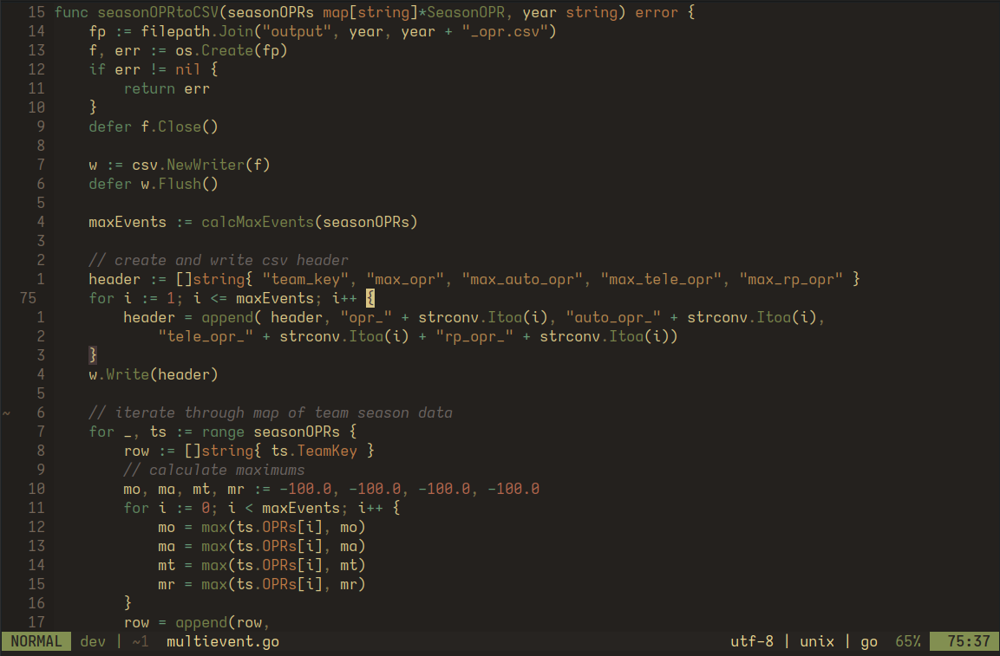

# DarkEarth Nvim
An dark and earthy color scheme for Neovim.



Based on [miasma.nvim](https://github.com/xero/miasma.nvim), and built with [lush](https://github.com/rktjmp/lush.nvim).

## Installation

Lazy:
```lua
{
    "ptdewey/darkearth-nvim",
    priority = 1000,
},
```

## Disclaimer
This color scheme is early in development and things are subject to change.
