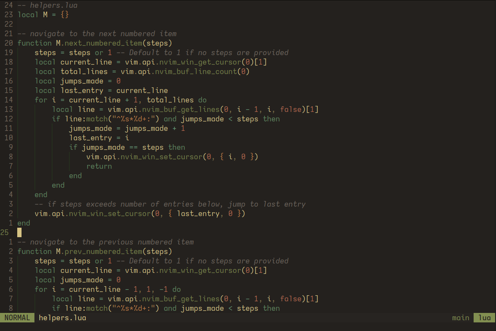

<h1 align="center">DarkEarth</h1>

<p align="center">
    A dark and earthy colorscheme for Neovim.
</p>

<p align="center">
    
</p>

<p align="center">
    
</p>

Based on [miasma.nvim](https://github.com/xero/miasma.nvim), reimagined with earthier tones and more colorful syntax elements.

## Installation

Lazy:
```lua
{
    "ptdewey/darkearth-nvim",
    priority = 1000,
},
```

`vim.pack`:
```lua
vim.pack.add({ "https://github.com/ptdewey/darkearth-nvim" })
```

## Usage

```lua
vim.cmd.colorscheme("darkearth")
```

## Build or Modify

1. [fennel](https://github.com/bakpakin/Fennel) or [hotpot.nvim](https://github.com/rktjmp/hotpot.nvim/tree/main) is installed
2. Modify [fnl/darkearth/init.fnl](fnl/darkearth/init.fnl) as desired
3. Rebuild the colorscheme 
    - With `fennel`: Use `./build.sh` or `just build` ()
    - With `hotpot.nvim`: Builds are automatic upon saving `fnl/darkearth/init.fnl`

Note: The version of darkearth made with [lush](https://github.com/rktjmp/lush.nvim) can be found on the [v1 branch](https://github.com/ptdewey/darkearth-nvim/tree/v2)

## Extras

I have also included a base16 colorscheme script [extras/base16-darkearth.sh](extras/base16-darkearth.sh) that can be used to set shell colors.
