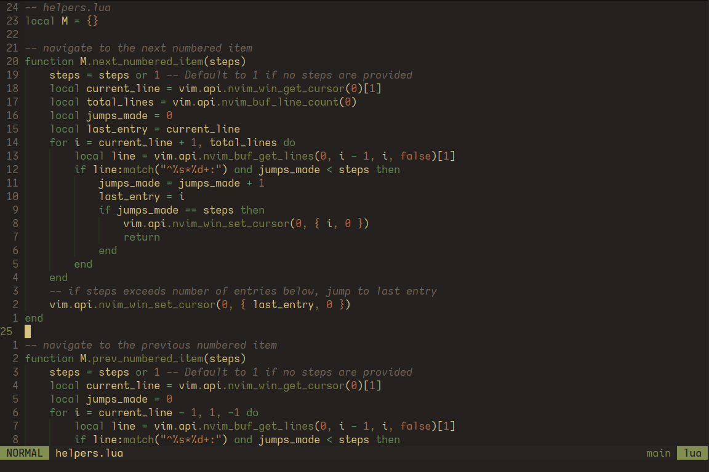
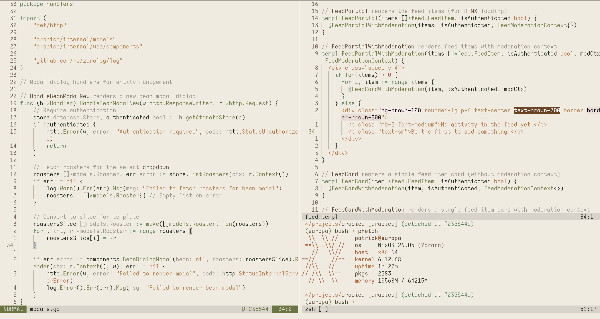

<h1 align="center">DarkEarth</h1>

<p align="center">
    A dark and earthy colorscheme for Neovim.
</p>

<p align="center">
    
</p>

<p align="center">
    
</p>

DarkEarth also comes with a light variant, LightEarth.

<p align="center">
    
</p>

## Installation

Lazy:

```lua
{
    "ptdewey/darkearth-nvim",
    priority = 1000,
},
```

`vim.pack`:

```lua
vim.pack.add({ "https://github.com/ptdewey/darkearth-nvim" })
```

## Usage

```lua
-- DarkEarth
vim.cmd.colorscheme("darkearth")

-- LightEarth
vim.cmd.colorscheme("lightearth")
```

## Build or Modify

1. [fennel](https://github.com/bakpakin/Fennel) or [hotpot.nvim](https://github.com/rktjmp/hotpot.nvim/tree/main) is installed
2. Modify the source files as desired:
   - Shared highlight groups are defined in [fnl/earth/macros.fnl](fnl/earth/macros.fnl)
   - Theme-specific colors and overrides are in [fnl/darkearth/init.fnl](fnl/darkearth/init.fnl) and [fnl/lightearth/init.fnl](fnl/lightearth/init.fnl)
3. Rebuild the colorschemes
   - With `fennel`: Use `./build.sh` or `just build`
   - With `hotpot.nvim`: Builds are automatic upon saving

Note: The version of darkearth built with [lush](https://github.com/rktjmp/lush.nvim) can be found on the [v1 branch](https://github.com/ptdewey/darkearth-nvim/tree/v1)

## Extras

I have also included a base16 colorscheme script [extras/base16-darkearth.sh](extras/base16-darkearth.sh) that can be used to set shell colors.

## Inspiration

- [miasma.nvim](https://github.com/xero/miasma.nvim) (What DarkEarth was originally forked from)
- [Everforest](https://github.com/sainnhe/everforest)
- [GruvBox](https://github.com/morhetz/gruvbox)
